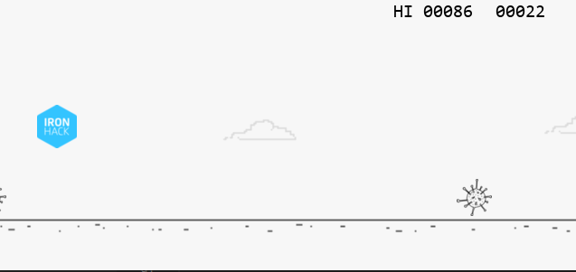

# Project: Ironhack vs Virus Python Game

## Overview

The goal of this project is to apply the Python programming skills I had learned during the first week of Ironhack Data Analytics Bootcamp.

This game was build using the Pygame library with functions, lists, if statements, loops (for and while), variables, classes, and more.

---

## Game Design

In this game, you have to jump the viruses that are coming, you can use the space key to jump.

As far as you go, it will get more difficult.

Good luck!

### Game Image

---

## HOW TO PLAY?

1. Install Python (https://www.python.org/downloads/) and Pygame (https://www.pygame.org/wiki/GettingStarted) in your computer 

2. Download this folder (PYTHON-PROJECT)

3. In your terminal, go to "Code" folder inside the "PYTHON-PROJECT" folder (the one that we just downloaded before)

4. Launch the command "python main.py"

5. Enjoy the game!

6. If you have any feedback or comments, send me an email to smunozan@gmail.com

7. Happy coding!